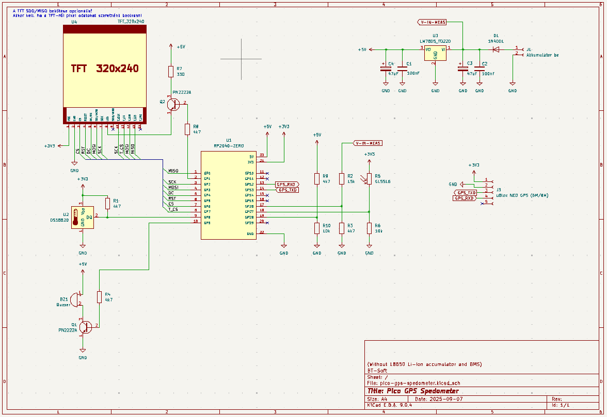

# Pico GPS Sebességmérő Motorokhoz

Ez a projekt egy fejlett Raspberry Pi Pico alapú GPS sebességmérő, amely egy ILI9488 TFT kijelzőt használ a sebesség, idő, magasság és a közeli sebességmérő kamerák (trafipaxok) megjelenítésére. A készülék kifejezetten motorkerékpár-vezetők számára lett tervezve, hogy segítse őket a biztonságos és szabályos közlekedésben.




<div style="display: flex; gap: 8px;">
  
  
</div>

## Főbb Jellemzők

### 🚀 **Sebességmérés és Navigáció**
- **Valós idejű sebességmérés** GPS adatok alapján 
- **Nagy méretű sebességmérő** vizuális megjelenítés
- **Műholdak száma** és jelerősség megjelenítése
- **Tengerszint feletti magasság** mérése és megjelenítése

### 🕐 **Időkezelés és Pozicionálás**
- **Pontos idő** megjelenítése GPS szinkronizációval
- **Automatikus időzóna** beállítás
- **Téli/nyári időszámítás** támogatása

### 🚨 **Trafipax Figyelmeztető Rendszer**
- **Intelligens sebességmérő kamera (trafipax) adatbázis** kezelése
- **Közeledési figyelmeztetés** max 1500 méteres beállítható távolságon belül (kör alapú megközelítés)
- **Vizuális riasztás**: piros háttér közeledéskor, narancssárga távolodáskor
- **Hangos figyelmeztetés** szirénával közeledés esetén
- **Távolság megjelenítése** a legközelebbi trafipaxig
- **Stabil állapotváltás** GPS pontatlansággal szembeni védelemmel

### 🎨 **Megjelenítés és Felhasználói Felület**
- **3.5" ILI9488 480x320 színes TFT kijelző**
- **Nagyméretű, jól olvasható** betűtípusok
- **Automatikusan állított háttérvilágítás** a környezeti fényerőkhöz igazodva

### 💾 **Adatkezelés és Testre Szabás**
- **LittleFS fájlrendszer** a beépített flash memóriában
- **CSV formátumú trafipax adatbázis** egyszerű frissítéshez
- **Konfigurálható figyelmeztetési távolságok**
- **Személyre szabható megjelenítési beállítások**

## Hardver Követelmények

- **Mikrokontroller:** Raspberry Pi Pico vagy Pico Zero (RP2040 alapú)
- **Kijelző:** ILI9488 3.5" 480x320 SPI TFT kijelző érintőképernyővel
- **GPS Modul:** Bármilyen UART-alapú GPS modul (pl. NEO-6M, NEO-8M), NMEA mondatok parszolása
- **Tápellátás:** 5V USB vagy külső tápegység
- **Rajz és NYÁK:** A kapcsolási rajzok, panel tervek a `kicad/` mappában

## Szoftver Architektúra

- **Fejlesztői környezet:** [PlatformIO](https://platformio.org/) a [Visual Studio Code](https://code.visualstudio.com/)-ban
- **Framework:** Arduino Framework [Raspberry Pi Pico](https://github.com/maxgerhardt/platform-raspberrypi) támogatással
- **Többmagos feldolgozás:** Dual-core RP2040 kihasználása
  - **Core 0:** Fő alkalmazás logika, kijelzőkezelés
  - **Core 1:** GPS adatfeldolgozás, háttér számítások

### Főbb Könyvtárak
- `bodmer/TFT_eSPI` - Kijelzőkezelés és sprite renderelés
- `mikalhart/TinyGPSPlus` - GPS adatfeldolgozás és koordináta számítások  
- `LittleFS` - Beépített fájlrendszer kezelés
- `NonBlockingDallas` - Hőmérséklet szenzor
- `FastLED` - Zeró intergrált RGB LED vezérlés (státusz jelzéshez, debug funkció)

## Telepítés és Üzembe Helyezés

### 1. Fejlesztői Környezet Beállítása
```bash
# Git repository klónozása
git clone https://github.com/bt-soft/pico-zero-ili9488-gps-spedometer.git
cd pico-zero-ili9488-gps-spedometer

# Visual Studio Code megnyitása
code .
```

### 2. Trafipax Adatbázis Feltöltése
A készülék kezdeti használatához fel kell tölteni a trafipax adatbázist:

```bash
# Adatbázis feltöltése LittleFS-be
pio run --target uploadfs
```

## Trafipax Adatbázis Kezelése

### Adatbázis Formátum
A `data/trafipaxes.csv` fájl formátuma:
```csv
Vármegye,Település neve,Útszám,Kilométer-szelvény/utca,GPS koordináta szélesség,GPS koordináta hosszúság
Pest,Alsónémedi,,Haraszti út 6.,47.315308,19.163705
Pest,Biatorbágy,,M1 17+000,47.468751,18.864466
Pest,Budapest,,M0,47.589436,19.142904
Pest,Budapest,,M0 14+450,47.400208,19.011840
...
```

### Adatbázis Frissítése

#### Feltöltés 
```bash
# 1. Új trafipaxes.csv elhelyezése a data/ mappában
# 2. Fájlrendszer feltöltése
pio run --target uploadfs

# 3. Készülék újraindítása (automatikus)
```


### Adatforrások
- **Magyarország:** [AutópályaMatrica.hu](https://www.autopalyamatrica.hu/fix-traffipax-lista-veda-terkep) adatai

**⚠️ Figyelmeztetés:** A trafipax adatok tájékoztató jellegűek. 

## Konfiguráció és Testreszabás
 A főbb hardveres pin hozzárendelések a `include/pins.h` fájlban találhatók, ezek igény szerint módosíthatók a saját bekötéshez.

 ### Főbb Pin Definíciók

 - **Serial1 TX/RX (GPS modul):**
   - TX: GPIO 12 (`PIN_SERIAL1_TX_NEW`)
   - RX: GPIO 13 (`PIN_SERIAL1_RX_NEW`)
   - Használat: A GPS modul csatlakoztatásához a soros portot át kell állítani ezekre a pinekre a `Serial1.setRX(PIN_SERIAL1_RX_NEW)` és `Serial1.setTX(PIN_SERIAL1_TX_NEW)` hívásokkal a `Serial1.begin()` előtt.

 - **TFT háttérvilágítás vezérlés:**
   - GPIO 1 (`PIN_TFT_BACKGROUND_LED`)
   - Automatikus fényerő szabályzás a környezeti fény alapján.

 - **Fényérzékelő:**
   - A1 (`PIN_LIGHT_SENSOR`)
   - A háttérvilágítás automatikus szabályzásához.

 - **Hőmérséklet szenzor (DS18B20):**
   - GPIO 8 (`PIN_DS18B20_TEMP_SENSOR`)

 - **Tápfeszültség mérés:**
   - VBUS: A0 (`PIN_VBUS_EXTERNAL_MEASURE_INPUT`)
   - VSYS: A2 (`PIN_VSYS_EXTERNAL_MEASURE_INPUT`)

 - **Buzzer (hangjelzés):**
   - GPIO 9 (`PIN_BUZZER`)

 A fenti pinek módosíthatók a saját hardverhez igazítva a `include/pins.h` fájlban. További testreszabási lehetőségek:
 - Trafipax figyelmeztetési távolság, hangjelzés, kijelző fényerő, stb. konfigurálható a szoftverben.
 

## Fejlesztői Információk

### Projekt Struktúra

```
├── src/                       # Fő forráskód és implementációk
│   ├── main.cpp               # Főprogram
│   ├── Config.cpp/.h          # Konfigurációs logika
│   ├── GpsManager.cpp/.h      # GPS kezelés
│   ├── DebugDataInspector.cpp/.h
│   ├── MessageDialog.cpp/.h
│   ├── SatelliteDb.cpp/.h
│   ├── Screen*                # Különböző képernyő logikák
│   ├── SensorUtils.cpp/.h     # Szenzor segédfüggvények
│   ├── TftBackLightAdjuster.cpp/.h
│   ├── TraffipaxManager.cpp/.h
│   ├── UIDialogBase.cpp/.h
│   ├── UIScreen.cpp/.h
│   ├── Utils.cpp/.h
│   └── ValueChangeDialog.cpp/.h
│   └── ... további modulok
├── include/                   # Header fájlok
│   ├── pins.h                 # Pin definíciók
│   ├── ... további .h fájlok
├── data/                      # LittleFS fájlok
│   └── trafipaxes.csv         # Trafipax adatbázis
├── Docs/                      # Dokumentáció
│   ├── pictures/              # Képek, renderelt ábrák
│   ├── TFT_eSPI/              # Kijelző setup és példák
│   └── trafipaxes.csv         # Minta adatbázis
├── kicad/                     # Hardver tervek
│   ├── pico-gps-spedometer/   # Fő kapcsolási rajzok, PCB
│   ├── pico-gps-spedometer-accu/ # Akkumulátoros verzió
├── platformio.ini             # PlatformIO konfiguráció
├── upload_fs.py               # Fájlrendszer feltöltő script
├── info.txt                   # Projekt információk
└── .vscode/                   # VS Code beállítások
```


**Fontos:** A TFT_eSPI könyvtár megfelelő működéséhez a `Docs/TFT_eSPI/User_Setup.h` fájlt be kell másolni a következő helyre:

```
.pio\libdeps\pico\TFT_eSPI\User_Setup.h
```

Ez biztosítja, hogy a kijelző beállítások megfelelően érvényesüljenek a build során. Ha módosítod a kijelző vagy a pinek konfigurációját, ezt a fájlt frissíteni kell és újra bemásolni a fenti könyvtárba.


---
**Fejlesztő:** BT-Soft  
**Blog:** [https://electrodiy.blog.hu/](https://electrodiy.blog.hu/)  
**GitHub:** [https://github.com/bt-soft](https://github.com/bt-soft)  


---

**⚠️ Biztonsági figyelmeztetés:** Ez az eszköz csak tájékoztató célokat szolgál. A közlekedési szabályok betartása a vezető felelőssége. A készülék használata nem mentesít a figyelmes és szabályos vezetés kötelezettsége alól.


## Képek a POC projektről


<div style="display: flex; gap: 8px;">
  
  
  
  
  
  
</div>

